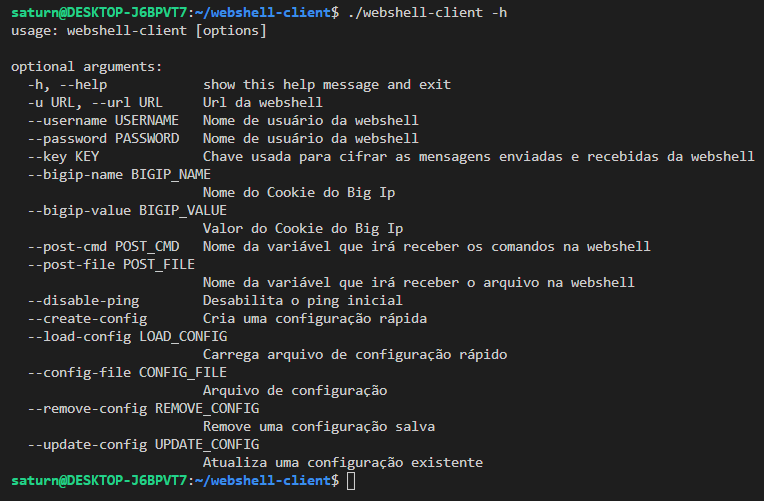
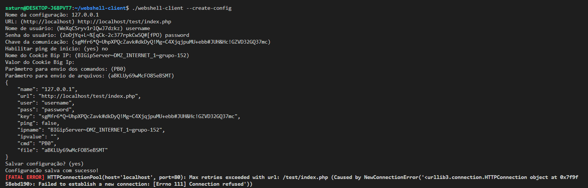
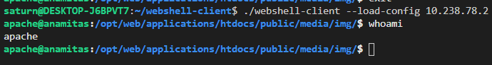

# webshell
Web shell com possibilidade de conexão via script em python

Uso do client:

`chmod +x webshell-client`

`./webshell-client -h`

Possbibilidade de criação de configurações:

Carregamento da configuração:

